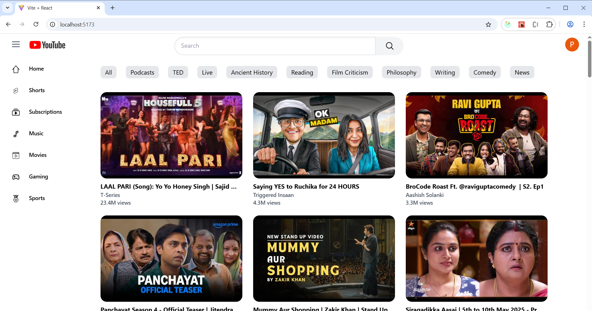
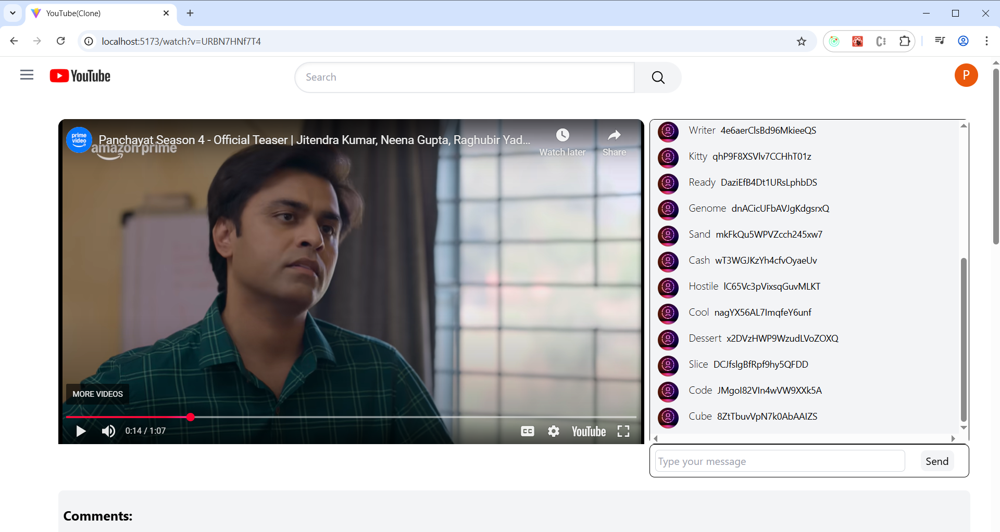
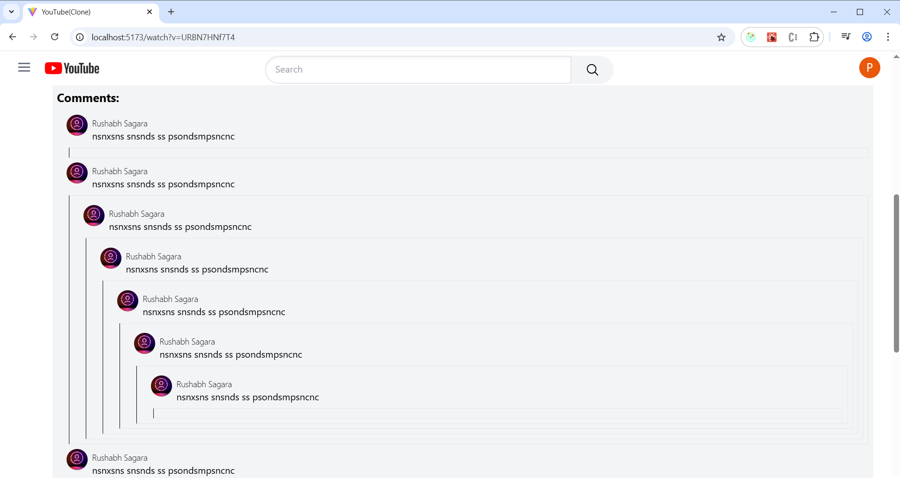

# 🎥 YouTube UI Clone

A fully functional YouTube UI clone built with **React**, **Redux Toolkit**, **TailwindCSS**, and **React Router DOM**.

This project replicates the core frontend experience of YouTube, including:

- 🔴 **Live Chat Simulation** using Redux & setInterval
- 💬 **Nested Comments System** with recursion
- 🎬 **Dynamic Video Embedding** via React Router’s query params
- 💡 **Component-driven architecture** with optimized folder structure

---

## 📸 Screenshots

### 🖥️ Home Page
- ### Home Page
 
### 🎬 Watch Page
 
### 💬 Live Chat
 
### 🧵 Nested Comments



## 🚀 Features

| Feature              | Description                                                       |
| -------------------- | ----------------------------------------------------------------- |
| 🔎 Search Simulation | Simulated search and dynamic video grid layout                    |
| 💬 Live Chat         | Auto-generated chat messages + manual input via Redux state       |
| 🧵 Nested Comments   | Recursively rendered threaded comments with reply hierarchy       |
| 🎥 Video Embedding   | Embedded YouTube player based on query param (e.g., `?v=videoId`) |
| 🧠 Redux Store       | Centralized state for live chat with `chatSlice.js`               |
| 🎨 TailwindCSS UI    | Clean responsive design using Tailwind utility classes            |


## 🛠️ Tech Stack

- React
- Redux Toolkit
- React Router DOM
- TailwindCSS
- Vite / Parcel (for dev build)

## 📁 Project Structure

├── components/
│   ├── Body.jsx
│   ├── Header.jsx
│   ├── Sidebar.jsx
│   └── WatchPage.jsx
│
├── chat/
│   ├── LiveChat.jsx
│   ├── ChatMessage.jsx
│   └── chatSlice.js
│
├── comments/
│   ├── CommentsContainer.jsx
│
├── utils/
│   └── helper.js
│
├── App.jsx
├── Main.jsx
└── store/store.js

## 🧪 How to Run Locally
1. Clone the repo
```bash
git clone https://github.com/yourusername/youtube-clone.git
cd youtube-clone
```
2. Install Dependencies
```bash
npm install
Run the dev server
```
3. Run the Dev server
```bash
npm run dev
Open in Browser
Visit http://localhost:5173
```

## 📦 Deployment
You can deploy this project using:

. Vercel

. Netlify

. Render

## 🙌 Acknowledgments
YouTube for UI inspiration

React & Redux community for docs and tools

ChatGPT for guidance and naming ideas 😉

## 🧑‍💻 Author
Rushabh Sagara
LinkedIn | GitHub

## 🌟 Like this project?
Give it a ⭐ on GitHub and share your feedback!🌟 Like this project?
Give it a ⭐ on GitHub and share your feedback!
